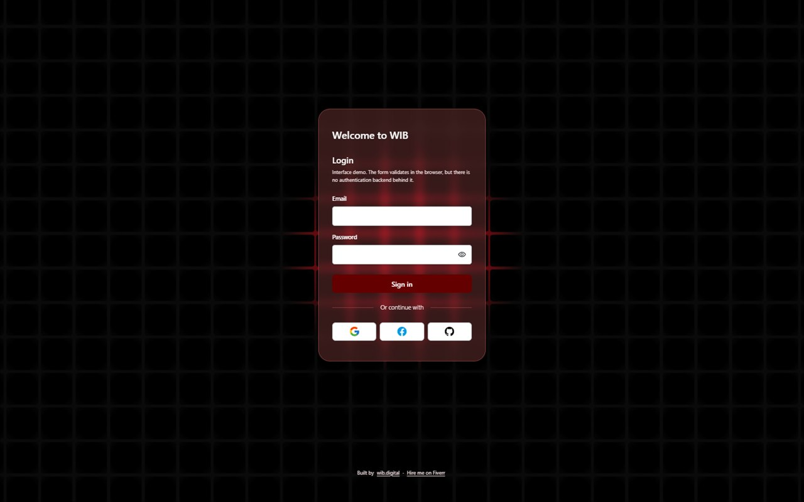

# Modern-Log-In

Login screen built in React, with a 3D Spline scene as the background and a password visibility toggle.

[](https://modernlogin.wib.digital)
[](https://www.fiverr.com/pablonietop)
[](https://react.dev)
[](LICENSE)



## Description

A front-end exercise in making an authentication screen feel like a product rather than a form. A live Spline scene sits behind the page instead of a static hero image, and the card holds email, password, a visibility toggle and three social sign-in buttons.

There is no authentication behind it. The form validates in the browser — email format, password length — and then says plainly that nothing was sent, because there is no backend, no token handling and no provider wired up. The social buttons do the same. This is the interface layer on its own: a starting point to attach a real provider to, not a working login.

The 3D scene is treated as an enhancement rather than a requirement. The background is drawn in CSS first, the Spline runtime is code-split into its own chunk and loaded after the form is interactive, and it is skipped entirely for anyone who has asked for reduced motion. If the CDN is unreachable the page still renders and still works.

## Features

- Spline 3D scene as the page background, lazy-loaded and wrapped in an error boundary.
- CSS grid-and-glow backdrop that renders instantly and stands in whenever the scene is absent.
- Client-side form validation with per-field messages, `aria-invalid`, and focus moved to the first invalid field.
- Password visibility toggle as a real button, with `aria-pressed` and an accessible name that reflects its state.
- A single polite live region that reports the outcome of the form and of each social button.
- Design tokens in `:root` — colour, spacing, type scale, radii, motion — driving every component.
- Mobile-first layout with no horizontal scroll from 320px up, and 44px minimum tap targets throughout.

## Tech stack

| Layer | Technology | Version | Role in project |
|---|---|---|---|
| UI library | React | 18.3.1 | Components and local state |
| Toolchain | react-scripts (Create React App) | 5.0.1 | Dev server, build, test runner |
| 3D | `@splinetool/react-spline` | 4.0.0 | Background scene |
| Styling | Plain CSS with custom properties | — | `src/styles/`, three layers, no preprocessor |
| Testing | Testing Library (react, dom, jest-dom, user-event) | 16.3.2 / 10.4.1 / 5.17.0 / 14.6.1 | Component tests |

## Prerequisites

- Node.js `>=14.0.0` — required by `react-scripts@5.0.1`
- npm 10 or newer

## Installation

```bash
git clone https://github.com/pabloWIB/Modern-Log-In.git
cd Modern-Log-In
npm install
npm start
```

Open `http://localhost:3000`. The Spline scene is fetched from Spline's CDN on load; everything else is served locally.

## Usage

The scene is referenced by URL in `src/components/scene-background.jsx`:

```jsx
const SCENE_URL = "https://prod.spline.design/BedHsbQnoGzxGCVf/scene.splinecode";
```

Replace it with your own published scene to change the background.

Validation rules live in `src/components/login-form.jsx`:

```jsx
const EMAIL_PATTERN = /^[^\s@]+@[^\s@]+\.[^\s@]{2,}$/;
const MIN_PASSWORD_LENGTH = 8;
```

To wire real authentication, replace the `onStatus(NO_BACKEND_MESSAGE)` call at the end of `handleSubmit` with your request. The validation, error rendering and live region are already in place around it.

## Project structure

```
├── public/
│   ├── index.html              # Document head: metadata, Open Graph, JSON-LD
│   ├── 404.html                # Standalone error page, styles inlined
│   ├── manifest.json           # PWA manifest, icons resolved from favicon/
│   ├── robots.txt              # Allows all, points at the sitemap
│   ├── sitemap.xml             # The single public URL
│   ├── og-image.jpg            # 1200x630 social preview
│   └── favicon/                # 16, 32, 180, 192 and 512px icons
├── src/
│   ├── index.jsx               # React root; imports the three stylesheets in order
│   ├── app.jsx                 # Page shell: backdrop, main, footer
│   ├── app.test.jsx            # Component tests for the whole screen
│   ├── setupTests.js           # Jest setup (name fixed by react-scripts)
│   ├── components/
│   │   ├── scene-background.jsx  # Lazy Spline + error boundary + reduced-motion opt-out
│   │   ├── login-card.jsx        # Card layout, owns the live-region status
│   │   ├── login-form.jsx        # Fields, validation, submit handling
│   │   ├── password-field.jsx    # Password input and visibility toggle
│   │   ├── social-sign-in.jsx    # The three provider buttons
│   │   └── site-footer.jsx       # Attribution links
│   ├── styles/
│   │   ├── base.css            # Tokens, reset, typography, focus, reduced motion
│   │   ├── layout.css          # Page shell, backdrop, footer, breakpoints
│   │   └── components.css      # Card, fields, buttons, divider, status
│   └── assets/icons/           # eye, eye-off, google, facebook, github
└── docs/
    ├── auditoria.md            # State of the project before the reorganisation
    ├── cambios.md              # Change log by phase
    └── screenshots/login.jpg
```

## Scripts

| Command | Description |
|---|---|
| `npm start` | Dev server on `http://localhost:3000` |
| `npm run build` | Production build into `build/` |
| `npm test` | Jest in watch mode via react-scripts |
| `npm run test:ci` | Single non-interactive run |

## Testing

```bash
npm run test:ci
```

`src/app.test.jsx` covers the screen end to end: it renders the heading and both fields, submits empty and expects both error messages plus `aria-invalid`, rejects a malformed address and a short password, confirms the "nothing was sent" message on valid input, toggles password visibility in both directions, and checks that a social button reports its provider as not connected.

`window.matchMedia` does not exist in jsdom, so the reduced-motion check in `scene-background.jsx` returns early there and the Spline runtime never loads during tests. No mock is needed.

## Performance

Measured on the production build served over HTTP:

| Resource | Transferred |
|---|---|
| Document | 1.2 KB |
| `main.js` | 48.7 KB |
| `main.css` | 2.4 KB |
| Icons and favicons | ~22 KB |
| Spline runtime chunk | 522.9 KB |
| Spline scene file | 6.4 KB |
| **Total first load** | **~604 KB** |

The Spline runtime is the bulk of it and it is deferred: the document, stylesheet and `main.js` — about 52 KB — are all that stand between a cold cache and an interactive form.

## Deployment

Deployed on Vercel at [modernlogin.wib.digital](https://modernlogin.wib.digital). Build command `npm run build`, output directory `build`. No environment variables and no secrets — the Spline scene URL is a public resource.

`homepage` is set to `.` in `package.json`, so the build emits relative asset paths and `build/index.html` can also be opened straight from disk.

## License

MIT — see [LICENSE](LICENSE).

## Author

**Pablo Nieto Pérez** — [wib.digital](https://wib.digital)
GitHub: [@pabloWIB](https://github.com/pabloWIB)

---

## Hire me

I build **custom internal tools, CRMs and dashboards** for small teams, and
**conversion-focused websites** for businesses.

- [Custom internal tool, CRM or dashboard](https://www.fiverr.com/pablonietop/build-a-custom-internal-app-for-your-business) — from $45
- [Conversion-focused website](https://www.fiverr.com/pablonietop/convert-your-landing-page-design-to-code) — from $80
- [All my services on Fiverr](https://www.fiverr.com/pablonietop)
- [wib.digital](https://wib.digital)
